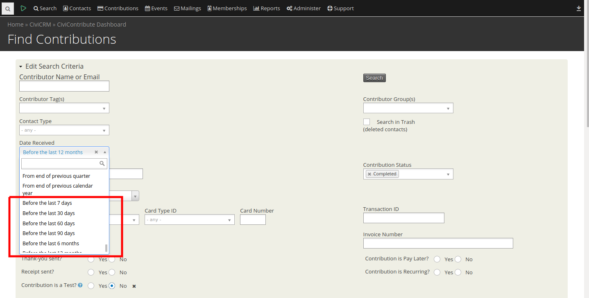

# hu.es-progress.relative-date-filters



This extension gives new date filters: before a given time interval.
E.g. Before the last 7 days, before the last 60 days

The extension is licensed under [AGPL-3.0](LICENSE.txt).

## Requirements

* PHP v7.0+
* CiviCRM (5.25) might work below - not tested

## Installation (Web UI)

This extension has not yet been published for installation via the web UI.

## Installation (CLI, Zip)

Sysadmins and developers may download the `.zip` file for this extension and
install it with the command-line tool [cv](https://github.com/civicrm/cv).

```bash
cd <extension-dir>
cv dl hu.es-progress.relative-date-filters@https://gitlab.com/semseysandor/hu.es-progress.relative-date-filters/-/archive/master/hu.es-progress.relative-date-filters-master.zip
```

## Installation (CLI, Git)

Sysadmins and developers may clone the [Git](https://en.wikipedia.org/wiki/Git) repo for this extension and
install it with the command-line tool [cv](https://github.com/civicrm/cv).

```bash
git clone https://gitlab.com/semseysandor/hu.es-progress.relative-date-filters.git
cv en relative_date_filters
```

## Usage

After installation you can use the new date filters everywhere where is a date select.

## Known Issues

It overwrites the core `CRM_Utils_Date` class. The original file is saved in the extension dir as backup. But in case of an upgrade to CiviCRM this can cause problems.
